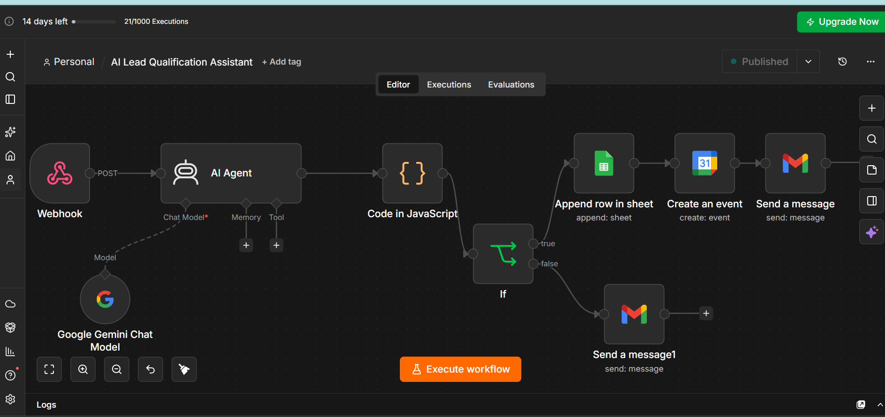
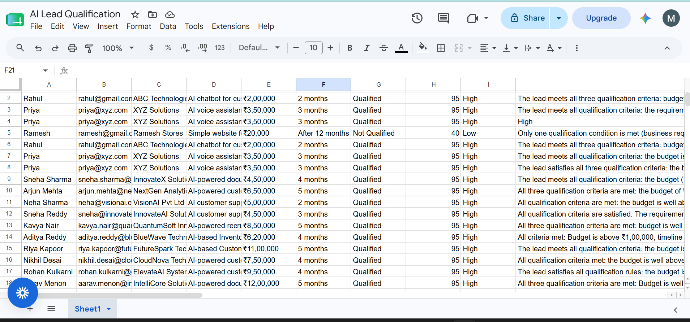
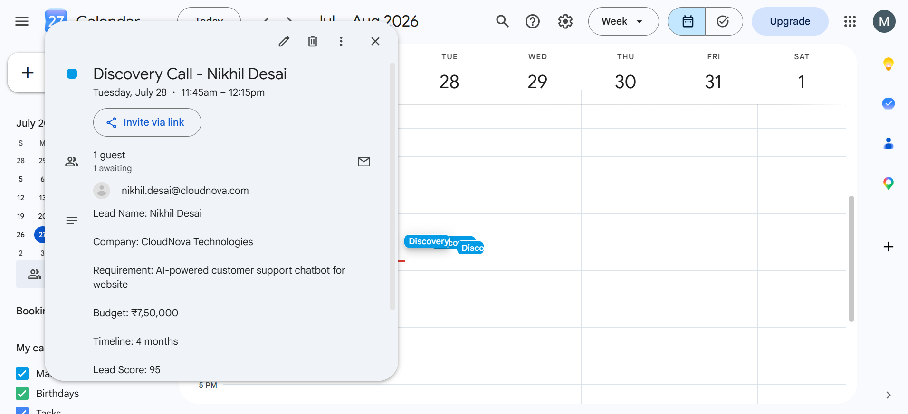
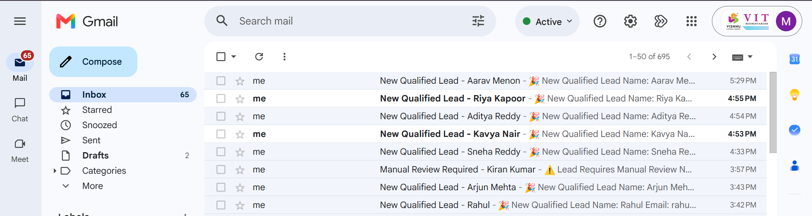
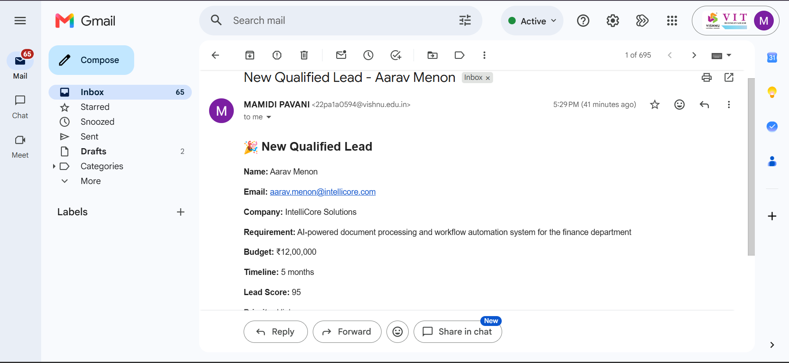
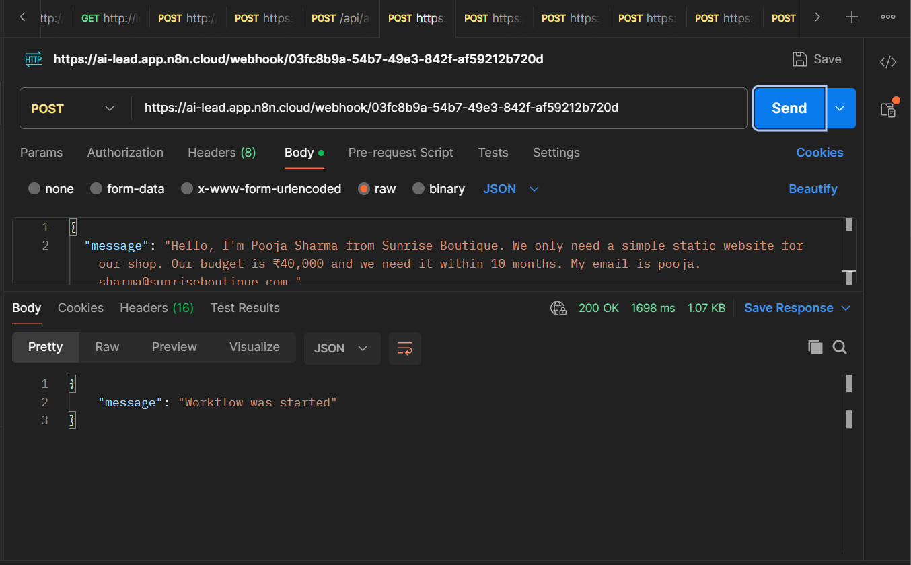

# 🤖 AI Lead Qualification Assistant

An AI-powered Lead Qualification workflow built using **n8n**, **Google Gemini AI**, **Google Sheets**, **Google Calendar**, and **Gmail**.

This workflow automatically analyses incoming leads, extracts business details using AI, qualifies them based on predefined criteria, stores qualified leads, schedules a discovery call, and notifies the sales team via email.

---

## 📌 Project Overview

Manual lead qualification is time-consuming and inconsistent. This automation uses **Google Gemini AI** to intelligently evaluate incoming leads and route them automatically.

### Workflow Summary

```
Webhook
   │
   ▼
Google Gemini AI
   │
   ▼
JavaScript Parser
   │
   ▼
IF (Qualified?)
   ├───────────────┐
   │               │
Qualified     Not Qualified
   │               │
   ▼               ▼
Google Sheets   Gmail
   │          (Manual Review)
   ▼
Google Calendar
   │
   ▼
Gmail
(Qualified Lead)
```

---

# 🚀 Features

✅ AI-powered Lead Qualification

✅ Automatic Lead Score Generation

✅ Priority Classification (High / Medium /Low)

✅ Google Sheets Integration

✅ Google Calendar Meeting Creation

✅ Gmail Notification

✅ Human Handoff for Non-qualified Leads

✅ REST API using n8n Webhook

✅ Tested using Postman

---

# 🛠 Tech Stack

| Technology | Purpose |
|------------|---------|
| n8n | Workflow Automation |
| Google Gemini AI | AI Lead Analysis |
| Google Sheets | Lead Storage |
| Google Calendar | Discovery Call Scheduling |
| Gmail | Email Notifications |
| Postman | API Testing |

---

# ⚙️ Workflow Explanation

### 1. Webhook

Receives incoming lead details through an HTTP POST request.

---

### 2. Google Gemini AI

Extracts:

- Name
- Email
- Company
- Requirement
- Budget
- Timeline

Generates:

- Qualified / Not Qualified
- Lead Score
- Priority
- Reason

---

### 3. JavaScript Code Node

Parses Gemini's JSON response into structured data.

---

### 4. IF Node

Checks:

```
Qualified == "Qualified"
```

If TRUE:

- Save lead to Google Sheets
- Create Google Calendar Event
- Send Gmail Notification

If FALSE:

- Send Manual Review Email (Human Handoff)

---

# 📥 API Endpoint

```
POST
```

```
https://ai-lead.app.n8n.cloud/webhook/03fc8b9a-54b7-49e3-842f-af59212b720d
```

---

# 📤 Sample Request

```json
{
  "message": "Hi, I'm Aarav Menon from IntelliCore Solutions. We need an AI-powered document processing workflow for our finance department. Budget is ₹12,00,000 and timeline is 5 months. Email: aarav.menon@intellicore.com"
}
```

---

# 📤 Sample AI Response

```json
{
  "name": "Aarav Menon",
  "email": "aarav.menon@intellicore.com",
  "company": "IntelliCore Solutions",
  "requirement": "AI-powered document processing workflow",
  "budget": "₹12,00,000",
  "timeline": "5 months",
  "qualified": "Qualified",
  "lead_score": 95,
  "priority": "High",
  "reason": "Lead satisfies qualification criteria."
}
```

---

# 📸 Screenshots

## 🔹 n8n Workflow



---

## 🔹 Google Sheets

Qualified leads are automatically stored.



---

## 🔹 Google Calendar

Discovery Call is automatically scheduled.



---

## 🔹 Gmail Notification

Qualified Lead Email



Manual Review Email



---

## 🔹 Postman Testing

Webhook tested successfully using Postman.



---

# 🧪 Testing

The workflow has been tested successfully for:

- ✅ Qualified Lead
- ✅ Not Qualified Lead
- ✅ Google Sheets Integration
- ✅ Google Calendar Event Creation
- ✅ Gmail Notification
- ✅ Manual Review Email
- ✅ Webhook Testing via Postman

---

# 👤 Human Handoff

If the lead is **Not Qualified**:

- No Calendar Event is created.
- The lead is not processed as qualified.
- A **Manual Review Email** is sent to the sales/admin team for further evaluation.

This ensures that potentially valuable leads are not discarded without human review.

---

# 📂 Repository Structure

```
AI-Lead-Qualification-Assistant/
│
├── README.md
├── AI Lead Qualification Assistant.json
├── n8n.png
├── sheets.png
├── calendar.png
├── mail1.png
├── mail2.png
└── postman.png
```

---

# ⚙️ Setup Instructions

1. Clone this repository.

```
git clone https://github.com/Mamidi-Pavani/AI-Lead-Qualification-Assistant.git
```

2. Import the workflow JSON into n8n.

3. Configure credentials for:

- Google Gemini AI
- Google Sheets
- Google Calendar
- Gmail

4. Activate the workflow.

5. Send a POST request to the webhook using Postman.

---

# 📈 Future Improvements

- CRM Integration (HubSpot / Salesforce)
- Slack Notifications
- WhatsApp Alerts
- Voice-based Lead Input
- Dashboard & Analytics
- Multi-language AI Support
- Follow-up Email Automation

---

# 🎥 Demo Video

Demo Video:

https://drive.google.com/file/d/1Rrpt6woKndqAIvlnbImyPjdq6e6GgxQb/view?usp=sharing

---

# 📁 Workflow File

The exported n8n workflow is included in this repository.

```
AI Lead Qualification Assistant.json
```

---

# 🔗 GitHub Repository

https://github.com/Mamidi-Pavani/AI-Lead-Qualification-Assistant

---

# 👩‍💻 Author

**Mamidi Pavani**

AI & Automation Engineer Internship Assignment

Built using **n8n + Google Gemini AI + Google Workspace**
